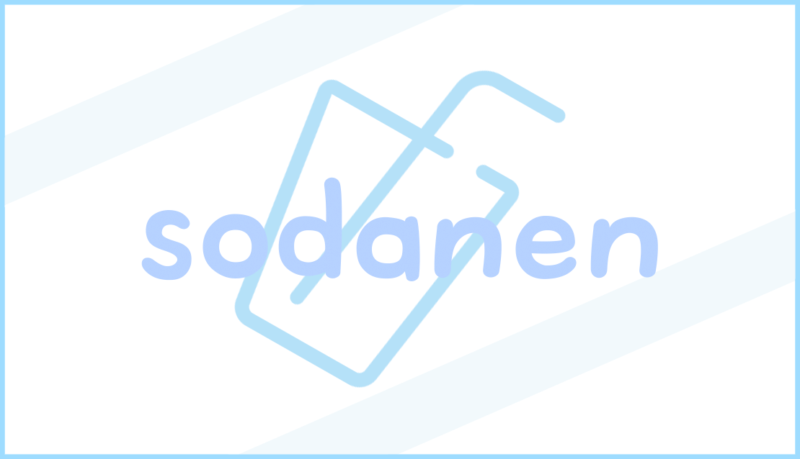

---

## ✨ 개인 연락

    
    

<table style="width: 100%; border-collapse: collapse; background-color: white; text-align: center;">
    <tr>
        <td style="border: 1px solid #ddd; padding: 8px;">Gmail</td>
        <td style="border: 1px solid #ddd; padding: 8px;">jun.codework@gmail.com</td>
    </tr>
    <tr>
        <td style="border: 1px solid #ddd; padding: 8px;">Private Email</td>
        <td style="border: 1px solid #ddd; padding: 8px;">Sodanen@Sodanen.com</td>
    </tr>
    <tr>
        <td style="border: 1px solid #ddd; padding: 8px;">Discord</td>
        <td style="border: 1px solid #ddd; padding: 8px;">Sodanen</td>
    </tr>
</table>

---

## ✨ 깃허브 활동

    
    

---

🛠️ 기술 스택 🛠️

### 사용 환경

### 개발 워크플로우

### 사용하는 언어

### 데이터베이스

### 기타 사용 가능한 소프트웨어

